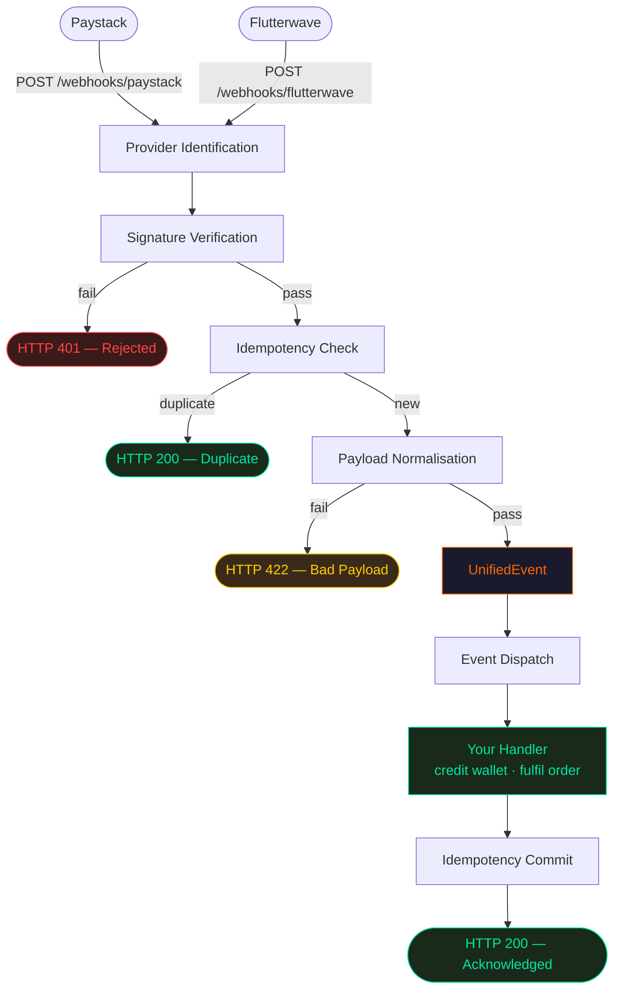

# PayloadOne

> Secure, normalised, idempotent webhook processing for Paystack and Flutterwave.

---

## What it does

Integrating payment webhooks is where most backends silently fail. PayloadOne fixes the three most common mistakes before your code ever runs:

- **Signature verification** — every inbound request is cryptographically verified (HMAC-SHA512 for Paystack, secret hash for Flutterwave) using time-constant comparison. Forged requests never reach your logic.
- **Normalisation** — Paystack and Flutterwave send completely different JSON structures for the same event. PayloadOne translates both into one consistent `UnifiedEvent` model so you write your handler once.
- **Idempotency** — gateways retry webhook delivery on slow or failed responses. PayloadOne checks every transaction reference against an atomic Redis or PostgreSQL ledger and guarantees your handler runs exactly once, no matter how many retries arrive.

---

## How it works



```
Inbound webhook
      ↓
1. Verify signature       → reject with 401 if invalid
2. Check idempotency      → return 200 silently if duplicate
3. Normalise payload      → produce a UnifiedEvent
4. Call your handler      → credit wallet, fulfil order, send email
5. Commit idempotency     → mark reference as processed
      ↓
Return 200 to gateway
```

Your handler only ever sees clean, verified, deduplicated events.

---

## Install

```bash
pip install "payloadone[redis,fastapi]"   # FastAPI + Redis
pip install "payloadone[redis,flask]"     # Flask + Redis
pip install "payloadone[all]"             # everything
```

Requires Python 3.11+.

---

## Quickstart

```python
from fastapi import FastAPI, Request
from payloadone import WebhookManager, PayloadOneConfig
from payloadone.models.event import UnifiedEvent
from payloadone.adapters.fastapi import install_exception_handlers, process_webhook

app = FastAPI()
manager = WebhookManager(config=PayloadOneConfig(
    secret_keys={
        "paystack":    "your-paystack-secret-key",
        "flutterwave": "your-flutterwave-secret-hash",
    },
    idempotency_backend="redis",
    redis_url="redis://localhost:6379",
))
install_exception_handlers(app)

@manager.on("payment.success")
async def handle_payment(event: UnifiedEvent) -> None:
    await credit_user_wallet(event.reference, event.amount_in_lowest_unit)

@app.post("/webhooks/{provider}")
async def webhook(provider: str, request: Request):
    return await process_webhook(manager, provider, request)
```

Point your dashboards at:
```
https://yourapi.com/webhooks/paystack
https://yourapi.com/webhooks/flutterwave
```

---

## Live Demo & Docs

Everything else — full integration guide, live testing, event reference, Flask examples — is in the documentation:

| | URL |
|---|---|
| 📖 Documentation & integration guide | https://payloadone-docs-ac0db7a9.quikdb.net |
| ⚡ Live demo API | https://payloadone |
| 🔍 Interactive API explorer | https://payloadone.quikdb.net/docs |
| 📋 Live event log | https://payloadone.quikdb.net/events |

Send a real webhook and watch it get verified, deduplicated, and normalised in seconds — no setup required.

---

## Running tests

```bash
poetry install --with dev
poetry run pytest
```

---

## License

MIT